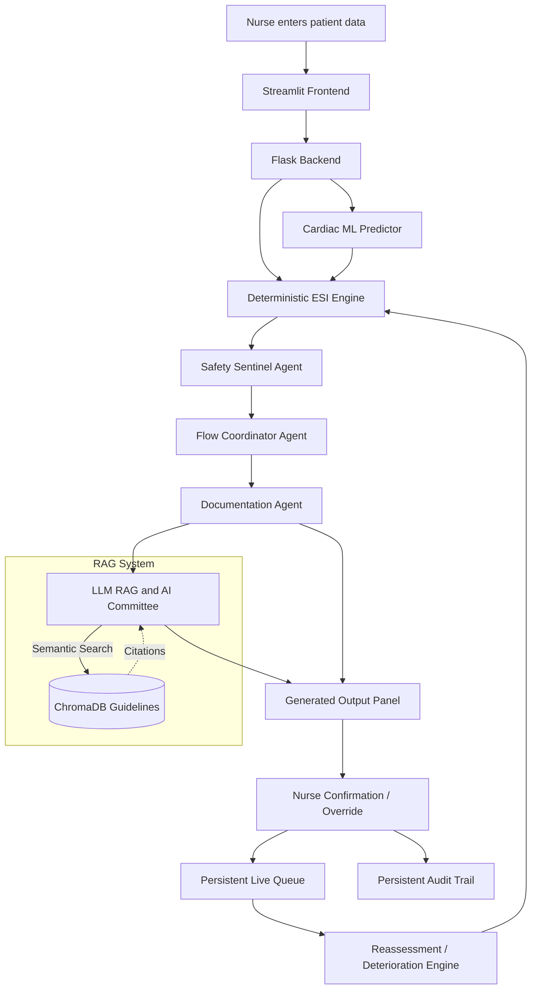
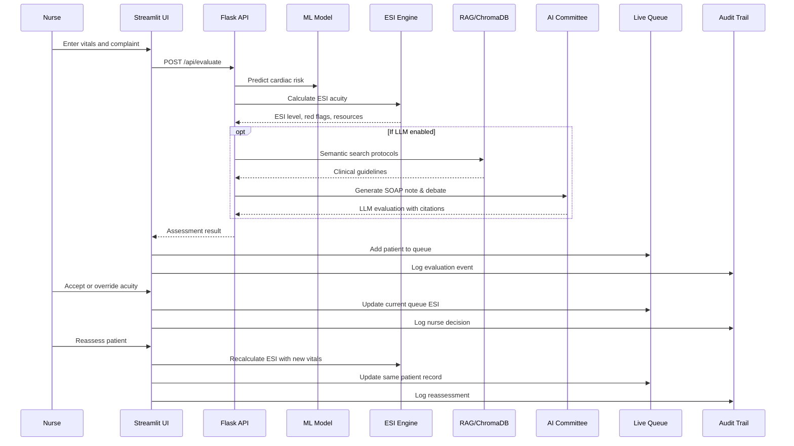

# Triage Assist AI — Emergency Department Command Center Prototype

Triage Assist AI is an **Emergency Department triage decision-support prototype** built with **Streamlit**, **Flask**, deterministic safety rules, machine-learning cardiac-risk prediction, and optional LLM command agents.

The app demonstrates how an AI-assisted triage workflow can support nurses with:

- ESI-style acuity scoring
- red-flag escalation detection
- live waiting-room prioritization
- nurse confirmation / override
- persistent audit trail
- reassessment and deterioration monitoring
- agentic workflow summaries using Safety, Flow, and Documentation agents

> **Important:** This is an educational and portfolio prototype only. It is **not** a validated medical device and must **not** be used for real patient-care decisions.

---

## Why this project matters

Emergency departments often face overcrowding, long wait times, and patients whose condition can worsen while they wait. A triage nurse must quickly decide:

- How urgent is this patient?
- Does the patient need immediate clinician review?
- Can the patient safely wait?
- Should the patient go to fast track?
- Has the patient deteriorated since arrival?
- Did the nurse accept or override the AI recommendation?

Triage Assist AI turns a simple risk-prediction app into a workflow-oriented **triage command center**.

---

## Key features

### 1. ESI-style acuity engine

The deterministic acuity engine recommends **ESI-1 through ESI-5**:

| ESI Level | Meaning | Urgency |
|---:|---|---|
| **ESI-1** | Immediate life-saving intervention | Most critical |
| **ESI-2** | High-risk / emergent | Very urgent |
| **ESI-3** | Urgent, likely multiple ED resources | Moderate |
| **ESI-4** | Less urgent, likely one resource | Lower |
| **ESI-5** | Non-urgent, no expected resources | Least critical |

The engine considers:

- chief complaint
- vital signs
- oxygen saturation
- respiratory rate
- pain score
- mental status
- arrival mode
- expected ED resources
- high-risk modifiers
- red-flag symptoms
- cardiac ML probability, only when cardiac context is confirmed

**Automatic red-flag protocol detection:**
- **Possible Stroke:** face droop, arm weakness, speech issue, onset time
- **Possible Sepsis:** fever/hypothermia, HR, RR, BP, altered mental status
- **Possible MI:** chest pain, age, diaphoresis, shortness of breath
- **Possible Respiratory Failure:** low SpO₂, high RR, distress
- **Possible Trauma Activation:** mechanism + hypotension + anticoagulant use

---

### 2. Chest-pain guardrail

The legacy cardiac ML input is separated from the true clinical triage complaint.

The app only treats chest pain as active when one of these is true:

- Chief complaint is **Chest pain / cardiac symptoms**
- The nurse checks **Active chest pain / cardiac symptoms present**
- Clinical notes mention chest-pain/cardiac symptoms

This prevents a minor injury/laceration case from being incorrectly escalated because an old ML dropdown was left on `Typical Angina`.

---

### 3. Live waiting-room queue

Each completed evaluation is added to a **persistent live queue**.

The queue tracks:

- patient ID
- wait time
- chief complaint
- current queue ESI
- AI-recommended ESI
- nurse-final ESI
- priority score
- target wait window
- breach/timing status
- safety flag
- reassessment/deterioration status
- queue status

The waiting-room board is sorted by:

1. ESI level
2. red flags
3. priority score
4. wait time

Lower ESI numbers are more critical, so ESI-1 and ESI-2 patients rise to the top.

**Example Command Board:**
| Wait | Patient | Complaint | ESI | Risk | Status | Next Action |
|---|---|---|---|---|---|---|
| 03 min | P001 | Chest pain | 2 | High | Needs bed | ECG + provider now |
| 18 min | P002 | Ankle injury | 4 | Low | Waiting | Fast track |
| 42 min | P003 | Fever/SOB | 2 | High | Deteriorating | Sepsis screen |

---

### 4. Nurse confirmation and override

The nurse remains in control of the final decision.

The app supports:

- **Accept AI recommendation**
- **Upgrade urgency / make patient more critical**
- **Downgrade urgency / make patient less critical**

If the AI recommends **ESI-1 or ESI-2** and the nurse downgrades to **ESI-4 or ESI-5**, the app requires a clinical reason before saving.

This is recorded in the audit trail as a high-risk downgrade event. This workflow loop turns the app from "AI gives answer" into "AI supports clinical workflow," which is significantly more credible.

---

### 5. Reassessment and deterioration engine

Queued patients can be reassessed with updated vitals.

The app compares old and new values for:

- heart rate
- systolic blood pressure
- oxygen saturation
- respiratory rate
- temperature
- pain score
- mental status
- active chest-pain status

It then recalculates ESI and updates the same patient record.

Example:

> **Patient P004** has waited 38 minutes. HR increased from 112 to 128. SpO₂ dropped from 95% to 91%. Recommend re-triage and escalation.

This moves the application from static one-time triage to real-time ED surveillance.

Reassessment does **not** create a new patient ID. It updates the existing patient in the queue.

---

### 6. Resource prediction & Explainable AI (XAI)

As outlined in the feature implementation strategy, commercial-grade tools need to explain their reasoning and predict hospital impact:
- **Resource Prediction:** The engine estimates likely ED resources (e.g., ECG, troponin, CBC, CMP, chest X-ray), likely disposition (e.g., observation/admission risk 62%), and fast-track eligibility based on the patient's presentation.
- **Per-Patient Explanation:** The XAI tab breaks down exactly *why* a specific acuity was chosen. For example:
  > **Why ESI-2?**
  > - Chest pain with high-risk features
  > - Systolic BP 185
  > - Age 72
  > - Likely requires multiple ED resources
  > - Not safe for fast track
- **Fairness Metrics:** Tracks model safety, precision, and bias/fairness breakdown on synthetic groups to ensure equitable triage. AHRQ specifically highlights equity and bias measurement as a core requirement of ED triage AI development.

---

### 7. Persistent audit trail

Workflow events are saved to a persistent audit log.

Audit events include:

- patient evaluated
- patient added to queue
- nurse accepted AI recommendation
- nurse upgraded or downgraded acuity
- patient escalated
- patient roomed
- patient reassessed
- patient discharged/removed
- queue reset

This supports the clinical pattern:

> AI recommends. Nurse confirms or overrides. System records the decision.

---

### 8. RAG (Retrieval-Augmented Generation) & System Memory

The application features advanced AI capabilities to ground decisions and remember past context:
- **RAG Knowledge Base:** An embedded ChromaDB vector store ingests `.txt` clinical guidelines from `data/guidelines/`. The optional AI Committee dynamically searches this knowledge base, retrieving and explicitly citing hospital protocols in their evaluations to reduce hallucinations.
- **System Memory:** Historical patient evaluations are stored in `data/memory.json`, allowing the system to reference prior encounters and maintain context across sessions.

---

### 9. Visible command agents

The app includes three visible command-center agents. They do **not** replace the deterministic ESI engine or the nurse-final decision.

| Agent | Role |
|---|---|
| **Safety Sentinel Agent** | Reviews red flags, ESI level, abnormal vitals, escalation risk, and downgrade risk |
| **Flow Coordinator Agent** | Reviews the queue and recommends which patient should be reviewed or roomed next |
| **Documentation Agent** | Generates SBAR-style handoff and audit-friendly summary text |

Pipeline:

```text
ESI Engine → Safety Sentinel → Flow Coordinator → Documentation
```

---

## Architecture



---

## Data flow



---

## Data sources

The machine-learning cardiac-risk layer trains on either real or synthetic datasets. The application supports toggling between four different dataset configurations:

1. **UCI Cleveland Original:** The classic [UCI Heart Disease dataset](https://archive.ics.uci.edu/ml/datasets/heart+Disease) downloaded automatically on startup.
2. **Synthetic Global Cohort (10k):** A generated dataset representing a standard distribution of 10,000 patients.
3. **High-Risk Elderly Cohort (2k):** A generated dataset specifically skewed toward patients over 60 with a high incidence of cardiac disease.
4. **Global General Population (50k):** A massive generated dataset representing a low-prevalence general population to demonstrate under-triage behavior and class imbalance.

---

## Technology stack

- **Frontend:** Streamlit
- **Backend:** Flask
- **ML:** scikit-learn, XGBoost
- **Optional LLMs:** Groq, Gemini
- **Persistence:** JSON / JSONL file-backed queue and audit logs
- **Visualization:** Streamlit UI, model metrics, XAI charts

---

## Decision engine options

The sidebar decision engine order is intentionally:

1. **Local Expert System (0 Tokens)**
2. **Groq**
3. **Google LLM (Gemini)**

The local expert system and ESI engine work with **zero tokens**. Groq and Gemini are optional.

---

## Project structure

```text
triage/
├── app.py                         # Local launcher
├── backend/
│   ├── app.py                     # Flask API routes
│   ├── esi_engine.py              # ESI-style acuity logic
│   ├── forecaster.py              # ML model prediction/training utilities
│   ├── data_loader.py             # Dataset loading
│   ├── logger.py                  # Transaction + audit logging
│   ├── memory.py                  # JSON memory helper
│   └── agents/
│       ├── triage_system.py       # Main evaluation pipeline
│       └── command_agents.py      # Safety, Flow, Documentation agents
├── frontend/
│   └── app.py                     # Streamlit user interface
├── data/
│   ├── xgboost_model.json
│   ├── heart_disease_model.json
│   ├── rf_model.pkl
│   ├── lr_model.pkl
│   ├── nn_model.pkl
│   ├── kmeans_model.pkl
│   ├── scaler.pkl
│   └── metrics.json
├── requirements.txt
├── run_all.bat                    # Windows startup helper
├── start.sh                       # Railway/container startup helper
├── Procfile                       # Deployment process file
└── README.md
```

Runtime files such as `patient_queue.json`, `audit_trail.jsonl`, `transactions.log`, and `memory.json` are created automatically and should not be committed.

---

## Installation

### 1. Clone the repository

```bash
git clone https://github.com/YOUR_USERNAME/YOUR_REPO_NAME.git
cd YOUR_REPO_NAME
```

### 2. Create and activate a virtual environment

Windows:

```bash
python -m venv venv
venv\Scripts\activate
```

macOS/Linux:

```bash
python -m venv venv
source venv/bin/activate
```

### 3. Install dependencies

```bash
pip install -r requirements.txt
```

---

## Environment variables

Create a local `.env` file if you want optional LLM support:

```env
GROQ_API_KEY=your_groq_key_here
GROQ_MODEL=llama-3.3-70b-versatile
GEMINI_API_KEY=your_gemini_key_here
GOOGLE_API_KEY=your_gemini_key_here
GOOGLE_GENAI_API_KEY=your_gemini_key_here
```

Do **not** commit `.env` to GitHub.

The app works without LLM keys by using the local expert system and deterministic ESI engine.

---

## Run locally

### Option 1: Python launcher

```bash
python app.py
```

### Option 2: Streamlit frontend directly

```bash
streamlit run frontend/app.py
```

### Option 3: Windows helper

```bash
run_all.bat
```

---

## Main screens

### Patient Evaluation

The nurse enters patient demographics, cardiac model features, ESI-style triage inputs, red-flag modifiers, and clinical notes.

After evaluation, the Generated Output Panel shows:

- assigned patient ID
- queue insertion status
- recommended ESI
- escalation status
- priority score
- fast-track status
- reassessment window
- command-agent summaries

### ESI Command Center

Shows the active waiting-room board, queue timing, breach status, safety flags, reassessment status, and patient actions.

### Nurse Confirmation / Override

Allows the nurse to accept, upgrade, or downgrade the AI recommendation. High-risk downgrades require documentation.

### Audit Trail

Displays persisted workflow events.

### Reassessment / Deterioration

Allows repeat vitals for queued patients and updates the same patient record after recalculating ESI.

### Model Metrics / XAI

Shows ML model metrics, feature importance, patient-vs-population comparison, and related explainability views.

---

## API endpoints

| Endpoint | Method | Purpose |
|---|---|---|
| `/api/evaluate` | POST | Run patient evaluation |
| `/api/queue` | GET / POST / DELETE | Read, save, or clear live queue |
| `/api/audit` | GET / POST | Read or append audit events |
| `/api/logs` | GET | Read transaction logs |
| `/api/memory` | GET | Read system memory |
| `/api/train` | POST | Train/retrain ML model |
| `/api/xai` | POST | Generate XAI outputs |
| `/api/metrics` | GET | Return model metrics |

---

## Suggested demo scenarios

| Scenario | Expected behavior |
|---|---|
| Chest pain + high heart rate | ESI-2, escalation required, not fast track |
| Minor laceration + stable vitals | ESI-4 or ESI-5, lower priority |
| Pain 8/10 then reassess pain 0/10 | ESI becomes less critical if no other red flags remain |
| AI ESI-2 downgraded to ESI-5 | Warning appears and clinical reason is required |
| Browser refresh | Queue remains because it is persisted to backend file storage |
| Reset System / Clear Queue | Active queue clears, audit trail remains |

---

## Safety and limitations

This project is not clinically validated. It is a prototype demonstrating software architecture, workflow design, and human-in-the-loop AI concepts.

Limitations:

- Uses file-backed persistence, not a production database
- Uses a cardiac-risk model as a demonstration ML layer
- ESI engine is rule-based and not clinically validated
- No real EHR/FHIR integration yet
- No authentication or role-based access control
- No HIPAA-grade deployment hardening
- No prospective clinical validation

---

## Future work

Potential next steps:

- SQLite/Postgres persistence
- role-based login for nurse, charge nurse, provider, admin
- FHIR / CDS Hooks integration simulator
- fairness and governance dashboard
- deployment hardening
- dashboard screenshots for README
- hospital-style patient status board
- exportable SBAR / PDF handoff reports

---

## Summary

Description:

> Triage Assist AI is an emergency-department triage command-center prototype that combines deterministic ESI-style acuity scoring, machine-learning cardiac-risk prediction, red-flag safety rules, nurse override, persistent audit trail, live queue management, reassessment/deterioration monitoring, and visible command agents for safety, flow coordination, and documentation.

---

## Disclaimer

This software is for education, experimentation, and portfolio demonstration only. It is not intended to diagnose, treat, triage, or manage real patients. A licensed clinician must make all real clinical decisions using validated clinical workflows and approved hospital systems.
