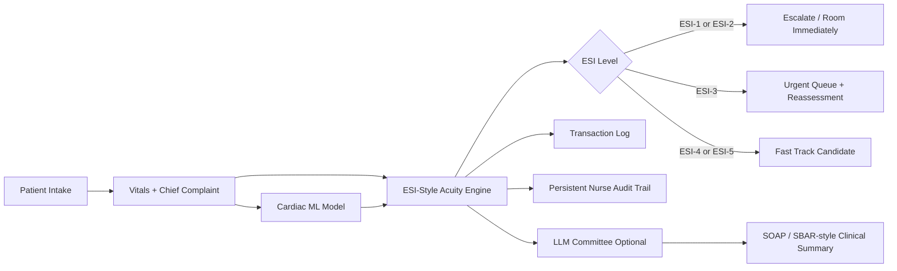

# Triage Assist AI

Triage Assist AI is a two-tier **Streamlit + Flask** clinical decision-support prototype. It combines classic machine-learning cardiac-risk prediction with a deterministic **ESI-style emergency acuity / priority engine** and optional LLM-generated clinical summaries.

> Educational prototype only. This is not a validated clinical device and must not be used to make real patient-care decisions.

## What is new in this version

### 🚦 ESI-Style Acuity / Priority Engine
A new deterministic triage layer has been added in:

```text
backend/esi_engine.py
```

The engine recommends **ESI-1 through ESI-5** using:

- unstable vital-sign triggers
- high-risk chief complaints
- altered mental status
- severe pain
- low oxygen saturation
- severe hypertension / tachycardia / tachypnea
- sepsis, stroke, chest-pain, trauma, allergic-reaction, and behavioral-health red flags
- likely ED resource count
- cardiac ML probability overlay only when active cardiac context is confirmed
- fast-track eligibility
- escalation requirement
- reassessment interval
- recommended next actions


### 🫀 Chest-Pain Input Consistency Guardrail
The UI now separates the legacy cardiac ML chest-pain feature from the actual triage chief complaint. The ESI engine only treats chest pain as active when one of these confirms it:

- Chief Complaint = `Chest pain / cardiac symptoms`
- the nurse checks `Active chest pain / cardiac symptoms present`
- clinical notes contain chest-pain/cardiac wording

This prevents a minor injury/laceration case from being incorrectly escalated as a chest-pain case just because the old ML dropdown was left on `Typical Angina`. If the legacy ML field conflicts with the chief complaint, the ESI card shows an input consistency note instead of using that field alone as a red flag.

### 🧠 ML + ESI Hybrid Logic
The existing ML model still predicts cardiac disease probability, but the new acuity engine decides workflow priority. This means a patient can be escalated even when the ML model is uncertain, because deterministic safety rules override the probability score.

### 📝 Updated Streamlit Intake Form
The frontend now includes additional triage fields:

- chief complaint
- active chest pain / cardiac symptoms confirmation
- temperature
- respiratory rate
- oxygen saturation
- pain score
- mental status
- arrival mode
- likely ED resources
- immunocompromised status
- pregnancy
- anticoagulant use
- suicidal / homicidal / overdose concern
- mobility status

### 🚨 Better Clinical Output
The assessment report now displays:

- recommended ESI level
- ESI-style priority score
- escalation status
- fast-track eligibility
- red flags
- likely ED resources
- recommended reassessment window
- recommended next actions

## Features

- **Decision Engine Options:** Local 0-token expert system first, Groq second for fast inference, and Gemini third for Google LLM-assisted assessment.
- **ESI-Style Acuity Engine:** Deterministic emergency workflow layer for ESI-1 to ESI-5 recommendations.
- **Machine-Learning Cardiac Risk:** XGBoost, Random Forest, and Logistic Regression options.
- **AI Committee Mode:** Analyst, Medical Reviewer, and Chief Editor pipeline for LLM-generated SOAP notes.
- **Visible Command Agents:** Safety Sentinel, Flow Coordinator, and Documentation Agent cards around the ESI workflow.
- **Safety Guardrails:** LLM prompts now treat the ESI-style engine as the safety source of truth and should not downgrade ESI-1/ESI-2 cases.
- **Transaction Logging:** Logs vitals, model, engine, token use, ESI output, and final report.
- **Persistent Live Waiting-Room Queue:** Saves active queue state to `data/patient_queue.json` through the Flask API so the board survives browser refreshes while the backend is running.
- **Persistent Nurse Audit Trail:** Saves queue entry, nurse accept/override decisions, escalation, rooming, reassessment, discharge/removal, and queue-clearing events to `data/audit_trail.jsonl`.
- **System Memory:** Stores prior evaluations in JSON memory.
- **Model Metrics Tab:** Shows Accuracy, Precision, Recall, and F1 Score.
- **Explainable AI Tab:** Shows feature importance, patient-vs-population comparison, and correlation matrix.

## Project Structure

```text
Triage-Assist-AI-main/
├── app.py                         # Local launcher
├── backend/
│   ├── app.py                     # Flask API
│   ├── esi_engine.py              # ESI-style acuity / priority engine
│   ├── forecaster.py              # ML training and prediction
│   ├── data_loader.py             # UCI / synthetic data loading
│   ├── logger.py                  # Transaction logging
│   ├── memory.py                  # JSON memory
│   └── agents/
│       ├── triage_system.py       # Evaluation pipeline + LLM committee
│       └── command_agents.py      # Safety Sentinel + Documentation command agents
├── frontend/
│   └── app.py                     # Streamlit UI
├── data/
│   ├── xgboost_model.json
│   ├── lr_model.pkl
│   ├── scaler.pkl
│   ├── metrics.json
│   ├── memory.json
│   ├── patient_queue.json         # Created automatically when queue state is saved
│   └── audit_trail.jsonl          # Created automatically when audit events occur
├── requirements.txt
├── start.sh                       # Railway/container startup
└── run_all.bat                    # Windows local startup
```

## Getting Started

### 1. Install dependencies

```bash
pip install -r requirements.txt
```

### 2. Optional LLM API keys

For Gemini:

```bash
set GEMINI_API_KEY=your_api_key_here
```

For Groq:

```bash
set GROQ_API_KEY=your_api_key_here
```

The local expert system and ESI-style engine run with **0 tokens**.

### Decision engine order

In the sidebar **Decision Engine** selector, the order is intentionally:

1. **Local Expert System (0 Tokens)**
2. **Groq**
3. **Google LLM (Gemini)**

This keeps the safest zero-token path first, with Groq immediately available as the fast LLM option.

### 3. Start locally

```bash
python app.py
```

This launches the Flask backend and Streamlit frontend, then opens the app in your browser.

### 4. Start in a container / Railway

```bash
bash start.sh
```

## How the triage flow works



## Clinical positioning

This app is best described as:

> An agentic emergency-department triage decision-support prototype that combines deterministic safety rules, machine-learning cardiac-risk prediction, explainable AI, and optional LLM-generated clinical summaries. The goal is not to replace triage nurses, but to support consistent acuity assignment, reduce under-triage risk, and improve ED workflow visibility.

## July 2026 UI Upgrade — Visible ESI Command Center

The ESI-style acuity engine is now surfaced directly in the Streamlit UI instead of being mostly hidden inside the generated report.

Visible workflow additions:

- Large ESI-1 to ESI-5 acuity card
- red-flag escalation banner
- likely ED resource chips
- reassessment timer
- fast-track eligibility indicator
- mini ED waiting-room command board
- dedicated **ESI Command Center** tab
- nurse confirmation / override audit panel

This makes the prototype look more like a hospital ED workflow dashboard rather than a single-patient cardiac-risk calculator.


## July 2026 UI Polish — Clear Evaluation Result Pane

This build improves the main Patient Evaluation screen so generated output no longer blends into the input form.

What changed:

- The old compact latest-result card was removed from the top of the input form.
- A new blue outlined **Generated Output Panel** now appears directly below the **Evaluate Patient** button.
- The panel clearly states that the evaluation is complete and shows the assigned queue patient ID, for example `P-004`.
- The panel confirms that the patient was added to the **Live Queue**.
- The panel summarizes chief complaint, recommended ESI level, queue status, priority score, escalation, fast-track status, and reassessment timing.
- The detailed ESI card, nurse confirmation/override panel, and assessment report now sit under that output panel.

This makes the workflow clearer: the top half of the page is for nurse input, and the clearly outlined output pane below the button is the generated triage result.

## July 2026 Workflow Upgrade — Persistent Live Waiting-Room Queue

This build replaces the computer-generated waiting-room demo board with a real queue that is persisted through the Flask backend.

What changed:

- Every completed patient evaluation is automatically added to a **Live Queue**.
- The active queue is saved to `data/patient_queue.json` through `GET /api/queue`, `POST /api/queue`, and `DELETE /api/queue`.
- The queue survives a browser refresh or Streamlit rerun while the Flask backend and `data/` directory are still available.
- After evaluation, the UI forces a clean Streamlit rerun so the right-side Mini ED Board updates immediately instead of requiring a manual refresh.
- The queue stores patient ID, arrival time, chief complaint, vitals, ESI result, priority score, red flags, fast-track status, likely resources, reassessment interval, next action, and status.
- The waiting-room board is sorted by **ESI level**, **red flags**, **priority score**, and **wait time**.
- Queue action buttons were added:
  - **Escalate**
  - **Room Patient**
  - **Mark Reassess**
  - **Discharge / Remove**
  - **Clear entire live queue**
- The app no longer shows fake/computer-generated waiting-room rows when no patients have been submitted.

Current limitation: this is file-backed persistence, not a production database. For real deployment, the next step would be SQLite/Postgres with user/session separation.

## UI Stability Fix: Nurse Override Widget Keys

This build fixes a Streamlit `DuplicateElementKey` crash caused by rendering the Nurse Confirmation / Override panel in more than one tab with the same widget keys. The override panel now accepts a unique `key_prefix`, so the main assessment view and the ESI Command Center can both render safely during the same Streamlit run.

Affected file:

- `frontend/app.py`

This fix should be applied before building the real waiting-room queue, because future per-patient override/action controls will also require unique keys per patient.


## July 2026 Audit Upgrade — Persistent Nurse / Workflow Audit Trail

This build adds a production-style audit trail for the workflow actions that happen after the AI recommendation.

New backend support:

- `backend/logger.py` now includes `log_audit_event()` and `read_audit_trail()`.
- `backend/app.py` now exposes `GET /api/audit` and `POST /api/audit`.
- Audit events are persisted to `data/audit_trail.jsonl`.

New UI support:

- New **📋 Audit Trail** tab in Streamlit.
- Dashboard expander showing recent audit events.
- Nurse confirmation / override now saves:
  - patient ID
  - AI-recommended ESI
  - final nurse ESI
  - accept/override decision
  - clinical judgement note
  - timestamp/source panel
- Queue actions now save audit events:
  - patient added to queue
  - escalated
  - roomed
  - marked for reassessment
  - discharged/removed
  - queue cleared

This separates the system into two logs:

1. `data/transactions.log` — model/agent evaluation log.
2. `data/patient_queue.json` — active waiting-room queue state.
3. `data/audit_trail.jsonl` — nurse/workflow action log.

That distinction makes the app more realistic: the AI recommends, the nurse confirms or overrides, and the system records the workflow decision trail.

## July 2026 UI/Workflow Fix — Nurse Override Updates the Live Queue

This build fixes two usability issues found during manual testing:

- The green status/help text in the generated output panel was too dark on the dark Streamlit theme. The panel text, tiles, and green queue message now use brighter high-contrast colors.
- Saving a nurse confirmation/override now updates the **Live Queue** immediately instead of only saving an audit event.

When the nurse selects a final ESI and clicks **Save Override / Confirmation**:

- The original AI recommendation is preserved as `ai_esi_level`, `ai_esi_label`, and `ai_priority_score`.
- The board-visible patient ESI is updated to the nurse-final ESI.
- The queue status changes to show that the nurse confirmed or overrode the acuity.
- The queue is re-saved to `data/patient_queue.json`.
- A persistent audit event is written to `data/audit_trail.jsonl`.
- The app reruns so the Mini ED Board / ESI Command Center reflects the change immediately.

This keeps the workflow clinically realistic: the AI recommends, but the nurse-final ESI becomes the operational queue priority.

## July 2026 Queue Timing + Reset Controls Upgrade

This build adds clearer waiting-room timing and safer demo controls.

New waiting-room board columns:

- **Wait** — elapsed time since the patient was added to the queue.
- **Target Wait** — expected review/rooming window based on the ESI/reassessment interval.
- **Breach / Timing** — shows whether the patient is OK, approaching target, needs a room now, or has breached the target.
- **Current Queue ESI** — the active ESI used for queue sorting. If the nurse overrides acuity, this becomes the nurse-final ESI.
- **AI Recommended ESI** — the original AI/ESI engine recommendation before nurse override.
- **Nurse Final ESI** — the nurse-confirmed or nurse-overridden ESI.
- **AI Priority Score** — the original AI/engine priority score.
- **Override Flag** — highlights clinically important override patterns, such as a high-risk AI recommendation being downgraded.

New controls:

- **Reset System / Clear Queue** in the sidebar clears the live queue and the latest generated result panel, then saves an empty queue through the backend. Historical audit trail records are intentionally retained.
- **Clear Patient Form** beside the Evaluate button resets only the patient intake form to neutral demo values. It does not clear the queue, audit trail, or latest generated result.

This makes the difference clearer between:

- clearing the current input form,
- clearing the active waiting room,
- and preserving the historical audit trail.

## July 2026 Reassessment + Deterioration Engine Upgrade

This build turns **Mark Reassess** from a simple status label into a working reassessment workflow.

What changed:

- The patient detail dialog now includes **Reassess vitals / deterioration engine**.
- A nurse can enter repeat values for:
  - heart rate
  - systolic blood pressure
  - oxygen saturation
  - respiratory rate
  - temperature
  - pain score
  - mental status
  - active chest-pain/cardiac symptom status
  - reassessment notes
- The app compares the new vitals against the previous vitals and detects deterioration triggers such as:
  - SpO₂ drop or low oxygen saturation
  - rising heart rate / marked tachycardia
  - low or severely high systolic blood pressure
  - abnormal or worsening respiratory rate
  - increased pain score
  - worsening mental status
  - ESI upgrade to a more urgent level
- The deterministic ESI engine recalculates the patient's acuity after reassessment.
- The **Current Queue ESI** updates in the waiting-room board after reassessment.
- The queue status changes to values such as:
  - `Deteriorating — reassessed to ESI-2 / escalate`
  - `Reassessed — stable at ESI-4`
  - `Reassessed — improved/lower acuity to ESI-5`
- The board now includes a **Reassess / Deterioration** column.
- The command board now shows a **Deteriorating** count.
- Each reassessment is saved into the patient record and persisted to `data/patient_queue.json`.
- Each reassessment is also written to the persistent audit trail as a `patient_reassessment` event.

This moves the app from one-time triage scoring toward a more realistic waiting-room surveillance workflow: evaluate, queue, reassess, detect deterioration, update acuity, and audit the action.

## July 2026 Nurse Override Wording Cleanup

The nurse override labels were renamed to reduce confusion around ESI numbering.

Old wording:

- `Accept AI acuity`
- `Override higher acuity`
- `Override lower acuity`

New wording:

- `Accept AI recommendation`
- `Upgrade urgency / make patient more critical`
- `Downgrade urgency / make patient less critical`

Reminder: with ESI, **lower numbers are more urgent**. ESI-1 is most critical. ESI-5 is least critical.

## July 2026 Final Safety / Portfolio Polish Upgrade

This build applies the final safety and presentation fixes recommended after manual testing.

What changed:

- Removed the hard-coded Windows debug path from the reassessment workflow. Reassessment now works without writing to `d:/Work/.../debug.txt`, which makes the app safer for Railway, Linux, GitHub, and other machines.
- Added a high-risk downgrade guardrail for nurse overrides:
  - If the AI/ESI engine recommends **ESI-1** or **ESI-2** and the nurse selects **ESI-4** or **ESI-5**, the UI shows a warning.
  - The app blocks saving until the nurse enters a clinical judgement reason.
  - The audit trail records `high_risk_downgrade: true` when this happens.
- Added validation for inconsistent override input:
  - If the nurse selects **Accept AI recommendation**, the final nurse ESI must match the AI recommendation.
  - If the final nurse ESI is different, the user should choose upgrade/downgrade instead.
- Added a **Patient Timeline** inside the patient detail dialog:
  - patient added to queue
  - nurse acuity confirmation/override
  - escalation/rooming/reassessment/discharge actions
  - ESI changes after reassessment
  - high-risk downgrade documentation
- Improved the waiting-room board:
  - compact board now shows **Current Queue ESI**, **AI Recommended ESI**, **Nurse Final ESI**, **Target Wait**, **Breach / Timing**, **Safety Flag**, and **Reassess / Deterioration**.
  - high-risk nurse downgrade is visible as a safety flag.
- The zip/package was cleaned for sharing:
  - `.env`, `.git/`, `venv/`, `__pycache__/`, runtime queue files, old audit logs, transaction logs, memory files, and debug files are excluded from the returned zip.

The app is now close to portfolio-ready: it demonstrates ESI-style acuity scoring, red-flag safety logic, live queue management, nurse override, auditability, reassessment/deterioration monitoring, timing breach alerts, and patient-level workflow history.

## July 2026 Agentic Upgrade — Visible Command Agents

This build adds three visible command-center agents around the deterministic ESI engine. These agents do **not** replace the ESI engine or the nurse-final decision; they explain, coordinate, and document the workflow.

### Added agents

- **Safety Sentinel Agent**
  - reviews ESI level, red flags, abnormal vitals, escalation status, and input-consistency warnings
  - highlights high-risk cases and downgrade risk
  - reinforces that ESI-1 / ESI-2 cases should not be downgraded without a documented clinical reason

- **Flow Coordinator Agent**
  - reviews the active Live Queue
  - recommends which patient should be reviewed next
  - counts high-acuity patients, target-wait alerts, deterioration flags, and fast-track candidates
  - makes the waiting-room board feel more like an ED command-center workflow

- **Documentation Agent**
  - generates a concise SBAR-style handoff support summary
  - creates an audit-friendly triage note
  - summarizes ESI level, escalation status, likely resources, and reassessment target

### Where the agents appear in the UI

- The **Generated Output Panel** now shows an **Agentic Command Center Output** section after each evaluation.
- The **ESI Command Center** tab now shows a **Visible Command Agents** section.
- The **AI Committee Debate** tab now shows the deterministic command agents before any optional LLM committee output.
- The **Agent Execution Pipeline** now shows the flow as:

```text
ESI Engine → Safety Sentinel → Flow Coordinator → Documentation
```

### Design principle

The architecture remains clinically safer because the command agents are advisory/workflow agents only:

```text
Nurse Intake
  ↓
Deterministic ESI Engine + ML cardiac-risk overlay
  ↓
Safety Sentinel Agent
  ↓
Flow Coordinator Agent
  ↓
Documentation Agent
  ↓
Nurse confirmation / override
  ↓
Live Queue + Audit Trail
```

The ESI engine remains the safety source of truth, and the nurse-final ESI remains the operational decision shown in the waiting-room queue.
