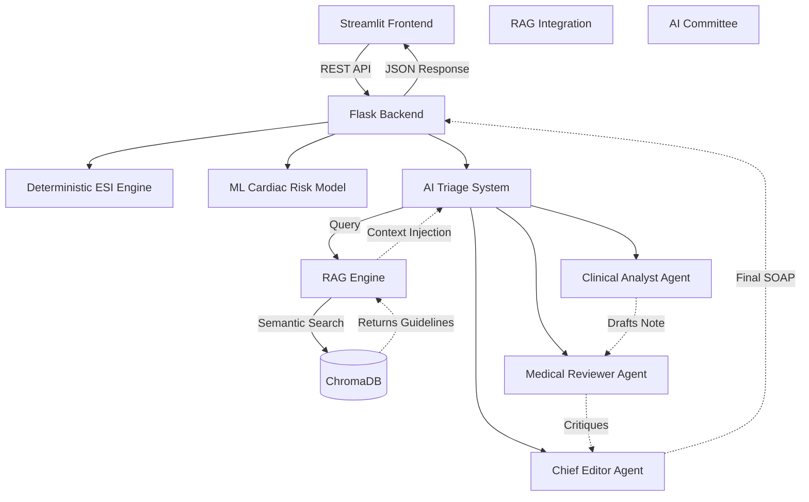
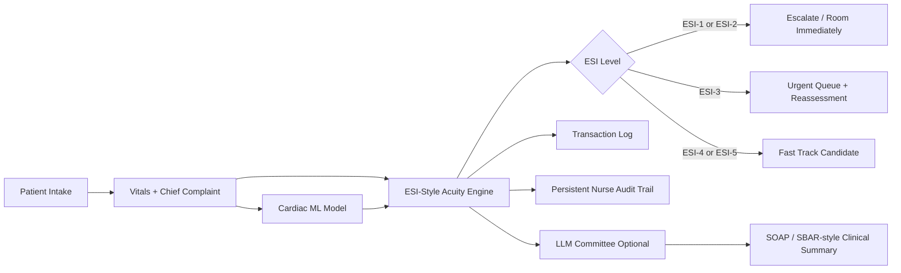

# Triage Assist AI

Triage Assist AI is a two-tier **Streamlit + Flask** clinical decision-support prototype. It combines classic machine-learning cardiac-risk prediction with a deterministic **ESI-style emergency acuity / priority engine** and optional LLM-generated clinical summaries.

> Educational prototype only. This is not a validated clinical device and must not be used to make real patient-care decisions.

## Clinical Positioning

This app is best described as:

> An agentic emergency-department triage decision-support prototype that combines deterministic safety rules, machine-learning cardiac-risk prediction, explainable AI, and optional LLM-generated clinical summaries. The goal is not to replace triage nurses, but to support consistent acuity assignment, reduce under-triage risk, and improve ED workflow visibility.

## Screenshots

*(Please replace these placeholders with the actual screenshot images)*

### Core Evaluation Workflow


### Agent Operations


### Data & Insights


## Architecture Overview



## How the Triage Flow Works



## Core Features

### 🚦 ESI-Style Acuity / Priority Engine
A deterministic triage layer recommends ESI-1 through ESI-5 based on unstable vitals, high-risk complaints, mental status, and likely ED resources. The ML model predicts cardiac probability, but the safety rules ultimately drive the acuity score.

### 🧠 Agentic Command Center
Three specialized agents operate around the deterministic engine to explain and coordinate the workflow:
- **Safety Sentinel Agent**: Reviews red flags and protects against risky acuity downgrades.
- **Flow Coordinator Agent**: Reviews the live queue and recommends next actions for waiting patients.
- **Documentation Agent**: Generates a concise SBAR-style handoff summary.

### 📚 RAG Architecture (Retrieval-Augmented Generation)
An embedded ChromaDB vector store ingests `.txt` clinical guidelines from `data/guidelines/`. The AI Committee dynamically searches the knowledge base, retrieving and explicitly citing hospital protocols in their evaluations.

### 🗂️ Persistent Live Waiting Room & Audit Trail
- **Live Queue**: Real-time waiting room board persisted across sessions. Nurses can escalate, room, reassess, or discharge patients.
- **Deterioration Watch**: Reassessing a patient's vitals automatically detects deterioration, recalculates the ESI score, and updates the queue.
- **Nurse Override**: Nurses can confirm or override the AI-recommended ESI. High-risk downgrades trigger safety warnings requiring clinical documentation.
- **Audit Trail**: Every workflow action (queue entry, override, escalation, reassessment) is securely logged to a persistent audit file.

## Getting Started

### 1. Install Dependencies
```bash
pip install -r requirements.txt
```

### 2. Configure API Keys (Optional)
The local expert system and ESI-style engine run entirely with **0 tokens**. However, you can configure external LLMs for the AI Committee features:

For Gemini:
```bash
set GEMINI_API_KEY=your_api_key_here
```
For Groq:
```bash
set GROQ_API_KEY=your_api_key_here
```

### 3. Launch the Application

**Run Locally:**
```bash
python app.py
```
This launches the Flask backend and Streamlit frontend, opening the app automatically in your browser.

**Run via Docker / Railway:**
```bash
bash start.sh
```

## Project Structure

```text
Triage-Assist-AI-main/
├── app.py                         # Local launcher
├── backend/
│   ├── app.py                     # Flask API
│   ├── esi_engine.py              # ESI-style acuity / priority engine
│   ├── forecaster.py              # ML training and prediction
│   ├── data_loader.py             # Data loading & preprocessing
│   ├── logger.py                  # Transaction logging
│   ├── memory.py                  # JSON memory
│   ├── rag_engine.py              # ChromaDB vector store and retrieval
│   └── agents/
│       ├── triage_system.py       # Evaluation pipeline + LLM committee
│       └── command_agents.py      # Safety Sentinel + Documentation agents
├── frontend/
│   └── app.py                     # Streamlit UI
├── data/
│   ├── guidelines/                # Folder for clinical .txt guidelines ingested by RAG
│   ├── chromadb/                  # Local vector database storage
│   ├── patient_queue.json         # Active queue state
│   └── audit_trail.jsonl          # Persistent workflow event logs
├── requirements.txt
└── start.sh                       # Container startup script
```

## Future Work

- **Document Upload UI**: Frontend interface for Hospital Administrators to drag-and-drop new PDF protocols directly into the RAG knowledge base.
- **Citation Hyperlinking**: Clickable citations in the AI Debate that open the exact paragraph of the source document in a modal.
- **Multi-modal RAG**: Expand the engine to ingest and reference visual algorithms (like ACLS flowcharts) alongside text protocols.
- **Physician Preference Cards**: Extending the vector database to store individual physician preferences for specific complaints.
